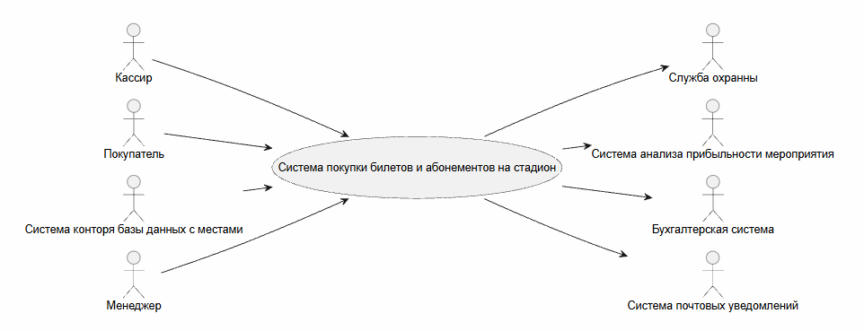

# Видение

## Даты вносимых изменений

| Версия | Дата | Описание | Автор |
--- | --- | --- | --- |
|Суперчерновой и начальный вариант| 18 сентября, 2026 | Это первый черновой вариант для уточнения подробностей. | Виталий Егоров |

## Введение 
Нам видится надежное приложение для автоматизации процесса покупки/продажи билетов и абонементов для стадионов, обеспечивающее механизмы поддержки работы нескольких терминалов, возможности автономного управления персоналом в случае отключения автоматизированной системы, а также взаимодействие с внешними системами и учетом билетов у служб охраны.

## Позиционирование

### Экономические предпосылки
Главным современным способом покупки билетов являются онлайн афишы от разных компаний, но в случае технической неполадки на их серверах или потери соединения с серверами самого стадиона произвести покупку просто не получится. Так же как и при отказе касс самообслуживания на территории самого стадиона пользователь не сможет произвести оплату. В существующих системах просто нет возможности быстрого перехода от автономного сервиса к ручному.

### Формулировка проблемы 
Ставшие уже традиционными системы для покупки билетов, просто не имеют физического аналога, в случае полного разрыва соединения сервера стадиона с внешней сетью интернет покупка билета вовсе станет не возможной. Так же если стадион будет имет собственную систему для продажи билетов/абонементов, менеджеры смогут полностью просматривать всю статистику и решать, какие матчи будут приносить им больше денег.

### Место системы 
Предлагаемая нами система будет работь внутри киосков для самообслуживания и кассовых машинах кассиров на территории стадионов, которые будут этйо системой пользоваться. При этом систему можно также хостить на веб-сайте для продажи билетов полностью онлайн. А при условии свзяи системы покупки билетов с системами службы охраны и системой анализа прибыльности мероприятий, можно организовать быстрый и удобной способ проверки подлинности билетов и просмотра статистики популярности различных мероприятий.

### Заинтерисованные лица 
К заинтересованным лицам, которые при этом пользователями самой системы ялвятся не будут можно отнести владельцев стадионов, менеджеров и службы охраны стадионов. Они напрямую не являются пользователями системы, но получают выгоду от возможности получения удобной статисткики и легкий способ проверки достоверности билетов даже в случае отключения интернета.

Пользователями системы являются покупатели, которые будут покупать или сдавать билеты или абонементы не только онлайн, но и на физических киосках самообслуживания или у кассиров.

### Задачи уровня пользователя 

### Окружение 

## Обзор 

### Перспективы продукта
Наша система будет устанавливаться на самих стадионах, при использовании мобильных терминалов внутри стадиона или на же онлайн ресурсе. Система будет обслуживать пользователей и при этом взаимодействовать с другими внешними системами, как показано на рисунке Видение 1. Данная контекстаная диаграмма является упрощенной диаграммой построенной на основе диаграммы преценлентов.

Рисунок Видение 1. Контекстаня диаграмма системы покупки билетов и абонементов на стадион 
### Преимущества системы 

### Основные свойства системы 

