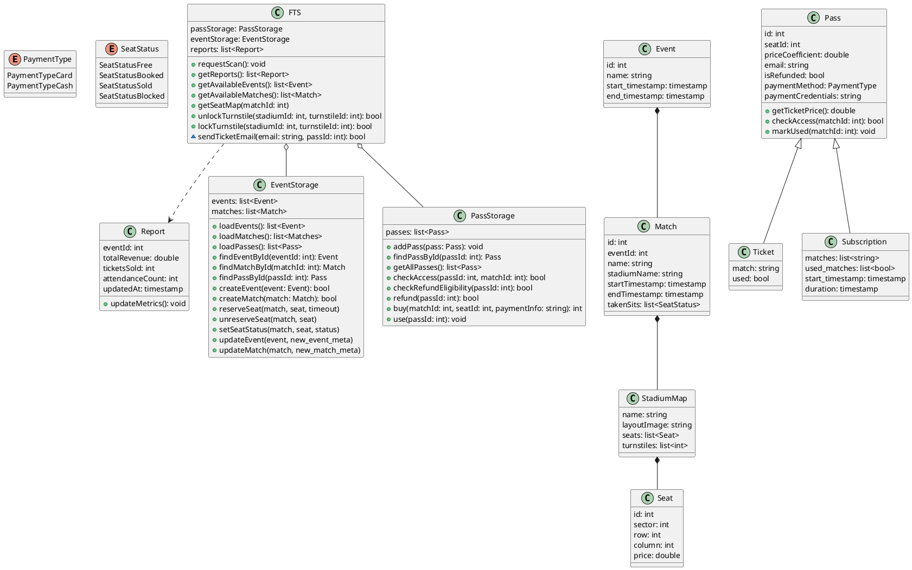

```plantuml
@startuml
enum PaymentType {
	PaymentTypeCard
	PaymentTypeCash
}

enum SeatStatus {
	SeatStatusFree
	SeatStatusBooked
	SeatStatusSold
	SeatStatusBlocked
}

class FTS {
	passStorage: PassStorage
	eventStorage: EventStorage
	reports: list<Report>
	+ requestScan(): void
    + getReports(): list<Report>
	+ getAvailableEvents(): list<Event>
	+ getAvailableMatches(): list<Match>
	+ getSeatMap(matchId: int)
	+ unlockTurnstile(stadiumId: int, turnstileId: int): bool
	+ lockTurnstile(stadiumId: int, turnstileId: int): bool
	~ sendTicketEmail(email: string, passId: int): bool
}

class Report {
	eventId: int
	totalRevenue: double
	ticketsSold: int
	attendanceCount: int
	updatedAt: timestamp
	+ updateMetrics(): void
}

class EventStorage {
	events: list<Event>
	matches: list<Match>
	+ loadEvents(): list<Event>
	+ loadMatches(): list<Matches>
	+ loadPasses(): list<Pass>
	+ findEventById(eventId: int): Event
	+ findMatchById(matchId: int): Match
	+ findPassById(passId: int): Pass
	+ createEvent(event: Event): bool
	+ createMatch(match: Match): bool
	+ reserveSeat(match, seat, timeout)
	+ unreserveSeat(match, seat)
	+ setSeatStatus(match, seat, status)
	+ updateEvent(event, new_event_meta)
	+ updateMatch(match, new_match_meta)
}

class Event {
	id: int
	name: string
	start_timestamp: timestamp
	end_timestamp: timestamp
}

class Match {
	id: int
	eventId: int
	name: string
	stadiumName: string
	startTimestamp: timestamp
	endTimestamp: timestamp
	takenSits: list<SeatStatus>
}

class StadiumMap {
	name: string
	layoutImage: string
	seats: list<Seat>
	turnstiles: list<int>
}

class Seat {
	id: int
	sector: int
	row: int
	column: int
	price: double
}

class PassStorage {
	passes: list<Pass>
	+ addPass(pass: Pass): void
	+ findPassById(passId: int): Pass
	+ getAllPasses(): list<Pass>
	+ checkAccess(passId: int, matchId: int): bool
	+ checkRefundEligibility(passId: int): bool
	+ refund(passId: int): bool
	+ buy(matchId: int, seatId: int, paymentInfo: string): int
	+ use(passId: int): void
}

class Pass {
	id: int
	seatId: int
	priceCoefficient: double
	email: string
	isRefunded: bool
	paymentMethod: PaymentType
	paymentCredentials: string
	+ getTicketPrice(): double
	+ checkAccess(matchId: int): bool
	+ markUsed(matchId: int): void 
}

class Ticket extends Pass {
	match: string
	used: bool 
}

class Subscription extends Pass {
	matches: list<string>
	used_matches: list<bool>
	start_timestamp: timestamp
	duration: timestamp
}

FTS o-- EventStorage
FTS o-- PassStorage
FTS ..> Report

Event *-- Match
Match *-- StadiumMap
StadiumMap *-- Seat
@enduml
```
