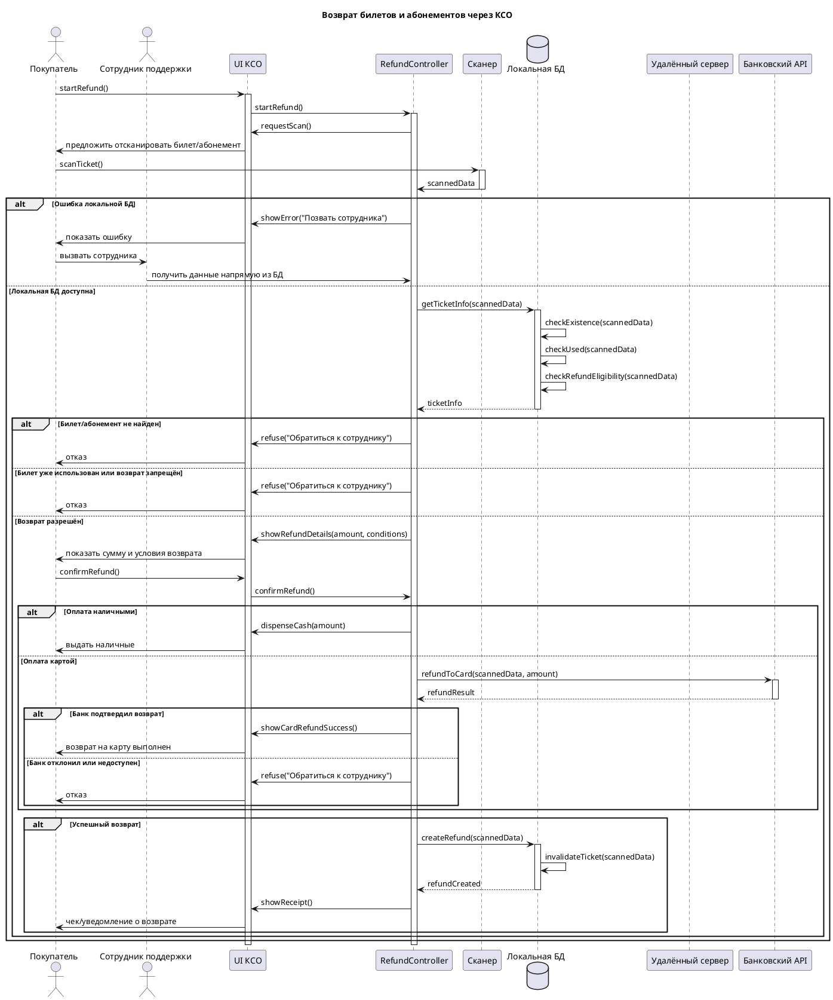

```plantuml
@startuml
title Возврат билетов и абонементов через КСО

actor "Покупатель" as Buyer
actor "Сотрудник поддержки" as Support
participant "UI КСО" as UI
participant "RefundController" as Controller
participant "Сканер" as Scanner
database "Локальная БД" as LocalDB
participant "Удалённый сервер" as Remote
participant "Банковский API" as Bank

Buyer -> UI : startRefund()
activate UI
UI -> Controller : startRefund()
activate Controller
Controller -> UI : requestScan()
UI -> Buyer : предложить отсканировать билет/абонемент

Buyer -> Scanner : scanTicket()
activate Scanner
Scanner -> Controller : scannedData
deactivate Scanner

alt Ошибка локальной БД
    Controller -> UI : showError("Позвать сотрудника")
    UI -> Buyer : показать ошибку
    Buyer -> Support : вызвать сотрудника
    Support -> Controller : получить данные напрямую из БД
else Локальная БД доступна
    Controller -> LocalDB : getTicketInfo(scannedData)
    activate LocalDB
    LocalDB -> LocalDB : checkExistence(scannedData)
    LocalDB -> LocalDB : checkUsed(scannedData)
    LocalDB -> LocalDB : checkRefundEligibility(scannedData)
    LocalDB --> Controller : ticketInfo
    deactivate LocalDB

    alt Билет/абонемент не найден
        Controller -> UI : refuse("Обратиться к сотруднику")
        UI -> Buyer : отказ
    else Билет уже использован или возврат запрещён
        Controller -> UI : refuse("Обратиться к сотруднику")
        UI -> Buyer : отказ
    else Возврат разрешён
        Controller -> UI : showRefundDetails(amount, conditions)
        UI -> Buyer : показать сумму и условия возврата
        Buyer -> UI : confirmRefund()
        UI -> Controller : confirmRefund()

        alt Оплата наличными
            Controller -> UI : dispenseCash(amount)
            UI -> Buyer : выдать наличные
        else Оплата картой
            Controller -> Bank : refundToCard(scannedData, amount)
            activate Bank
            Bank --> Controller : refundResult
            deactivate Bank
            alt Банк подтвердил возврат
                Controller -> UI : showCardRefundSuccess()
                UI -> Buyer : возврат на карту выполнен
            else Банк отклонил или недоступен
		        Controller -> UI : refuse("Обратиться к сотруднику")
		        UI -> Buyer : отказ
            end
        end
        
        alt Успешный возврат
			Controller -> LocalDB : createRefund(scannedData)
	        activate LocalDB
	        LocalDB -> LocalDB : invalidateTicket(scannedData)
	        LocalDB --> Controller : refundCreated
	        deactivate LocalDB

	        Controller -> UI : showReceipt()
	        UI -> Buyer : чек/уведомление о возврате
		end
    end
end
deactivate Controller
deactivate UI

@enduml
```
