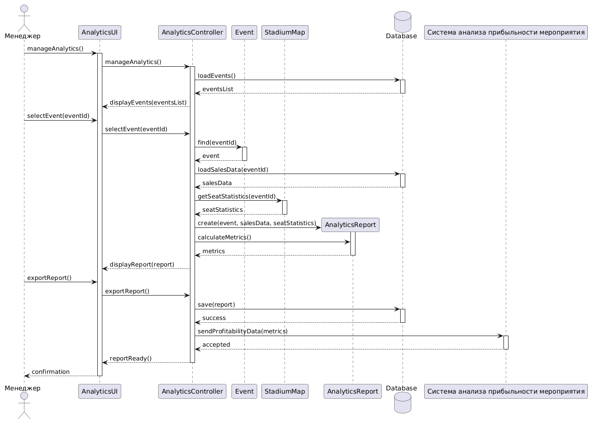
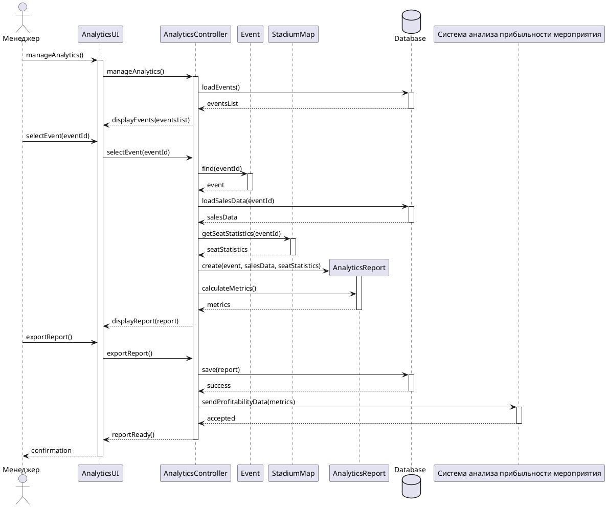

```plantuml

@startuml
actor "Менеджер" as Manager

participant "AnalyticsUI" as UI
participant "AnalyticsController" as Controller
participant "Event" as Event
participant "StadiumMap" as Map
participant "AnalyticsReport" as Report
database "Database" as DB
participant "Система анализа прибыльности мероприятия" as ProfitSystem

Manager -> UI : manageAnalytics()
activate UI
UI -> Controller : manageAnalytics()
activate Controller

Controller -> DB : loadEvents()
activate DB
DB --> Controller : eventsList
deactivate DB
Controller --> UI : displayEvents(eventsList)

Manager -> UI : selectEvent(eventId)
UI -> Controller : selectEvent(eventId)

Controller -> Event : find(eventId)
activate Event
Event --> Controller : event
deactivate Event

Controller -> DB : loadSalesData(eventId)
activate DB
DB --> Controller : salesData
deactivate DB

Controller -> Map : getSeatStatistics(eventId)
activate Map
Map --> Controller : seatStatistics
deactivate Map

create Report
Controller -> Report : create(event, salesData, seatStatistics)
activate Report
Controller -> Report : calculateMetrics()
Report --> Controller : metrics
deactivate Report

Controller --> UI : displayReport(report)

Manager -> UI : exportReport()
UI -> Controller : exportReport()
Controller -> DB : save(report)
activate DB
DB --> Controller : success
deactivate DB

Controller -> ProfitSystem : sendProfitabilityData(metrics)
activate ProfitSystem
ProfitSystem --> Controller : accepted
deactivate ProfitSystem

Controller --> UI : reportReady()
deactivate Controller
UI --> Manager : confirmation
deactivate UI

@enduml
```
