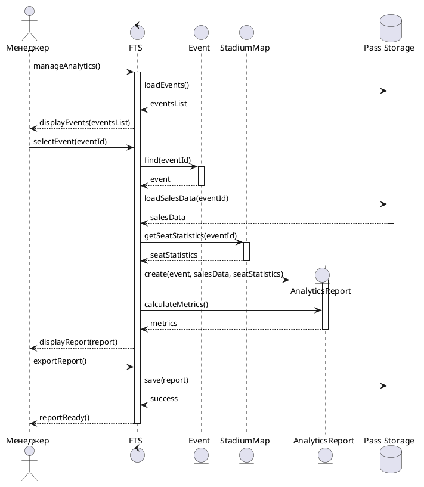
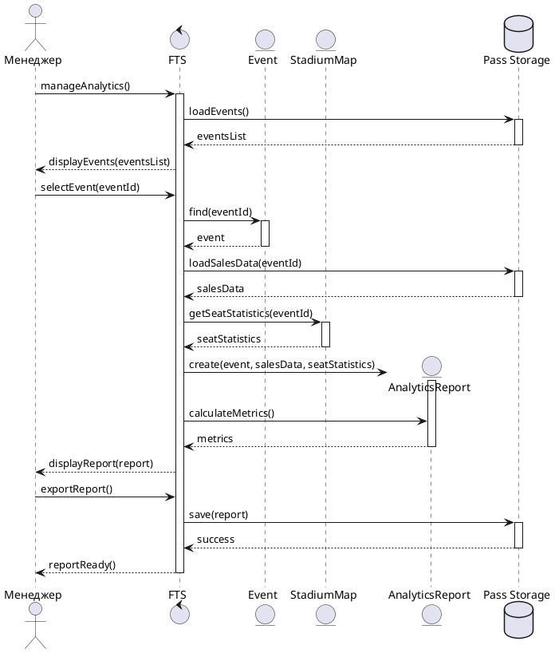

```plantuml

@startuml
actor "Менеджер" as Manager

control "FTS" as FTS
entity "Event" as Event
entity "StadiumMap" as Map
entity "AnalyticsReport" as Report
database "Pass Storage" as PassStorage

Manager -> FTS : manageAnalytics()
activate FTS

FTS -> PassStorage : loadEvents()
activate PassStorage
PassStorage --> FTS : eventsList
deactivate PassStorage
FTS --> Manager : displayEvents(eventsList)

Manager -> FTS : selectEvent(eventId)

FTS -> Event : find(eventId)
activate Event
Event --> FTS : event
deactivate Event

FTS -> PassStorage : loadSalesData(eventId)
activate PassStorage
PassStorage --> FTS : salesData
deactivate PassStorage

FTS -> Map : getSeatStatistics(eventId)
activate Map
Map --> FTS : seatStatistics
deactivate Map

create Report
FTS -> Report : create(event, salesData, seatStatistics)
activate Report
FTS -> Report : calculateMetrics()
Report --> FTS : metrics
deactivate Report

FTS --> Manager : displayReport(report)

Manager -> FTS : exportReport()
FTS -> PassStorage : save(report)
activate PassStorage
PassStorage --> FTS : success
deactivate PassStorage

FTS --> Manager : reportReady()
deactivate FTS

@enduml
```
