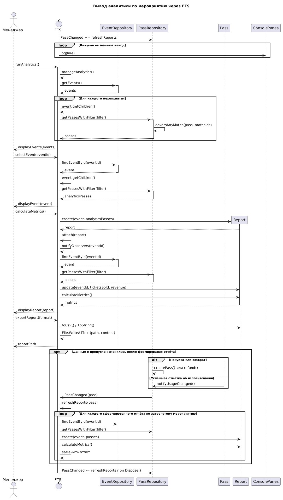
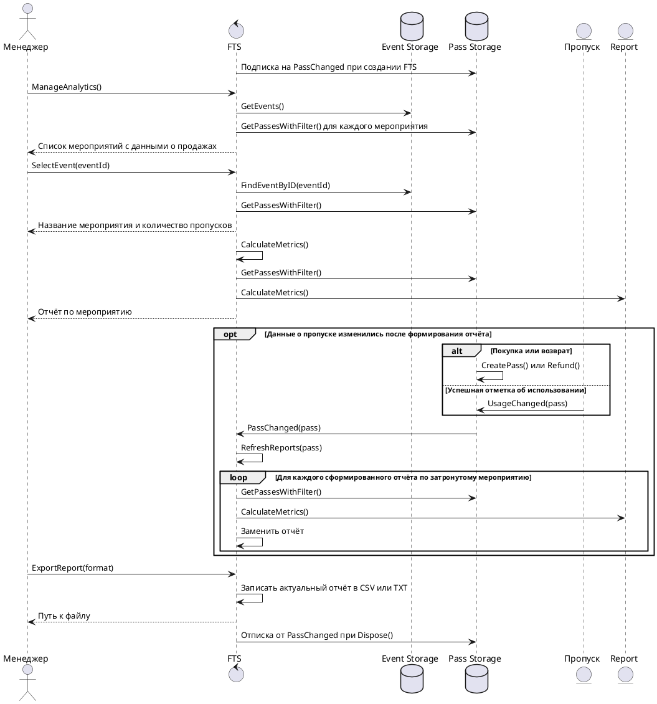

Диаграмма показывает текущую реализацию аналитики в FTS.

```plantuml
@startuml
actor "Менеджер" as Manager
control "FTS" as FTS
database "Event Storage" as EventStorage
database "Pass Storage" as PassStorage
entity "Пропуск" as Pass
entity "Report" as Report

FTS -> PassStorage : Подписка на PassChanged при создании FTS

Manager -> FTS : ManageAnalytics()
FTS -> EventStorage : GetEvents()
FTS -> PassStorage : GetPassesWithFilter() для каждого мероприятия
FTS --> Manager : Список мероприятий с данными о продажах

Manager -> FTS : SelectEvent(eventId)
FTS -> EventStorage : FindEventByID(eventId)
FTS -> PassStorage : GetPassesWithFilter()
FTS --> Manager : Название мероприятия и количество пропусков

FTS -> FTS : CalculateMetrics()
FTS -> PassStorage : GetPassesWithFilter()
FTS -> Report : CalculateMetrics()
FTS --> Manager : Отчёт по мероприятию

opt Данные о пропуске изменились после формирования отчёта
    alt Покупка или возврат
        PassStorage -> PassStorage : CreatePass() или Refund()
    else Успешная отметка об использовании
        Pass -> PassStorage : UsageChanged(pass)
    end
    PassStorage -> FTS : PassChanged(pass)
    FTS -> FTS : RefreshReports(pass)
    loop Для каждого сформированного отчёта по затронутому мероприятию
        FTS -> PassStorage : GetPassesWithFilter()
        FTS -> Report : CalculateMetrics()
        FTS -> FTS : Заменить отчёт
    end
end

Manager -> FTS : ExportReport(format)
FTS -> FTS : Записать актуальный отчёт в CSV или TXT
FTS --> Manager : Путь к файлу

FTS -> PassStorage : Отписка от PassChanged при Dispose()
@enduml
```
