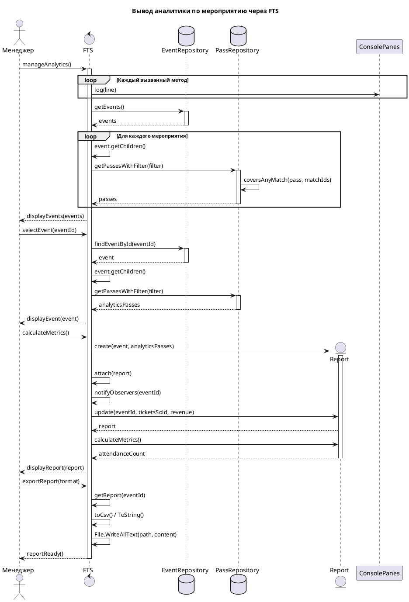

```plantuml
@startuml
title Вывод аналитики по мероприятию через FTS

actor "Менеджер" as Manager

control "FTS" as FTS
database "EventRepository" as EventRepository
database "PassRepository" as PassRepository
entity "Report" as Report
participant "ConsolePanes" as Panes

Manager -> FTS : manageAnalytics()
activate FTS

loop Каждый вызванный метод
    FTS -> Panes : log(line)
end

FTS -> EventRepository : getEvents()
activate EventRepository
EventRepository --> FTS : events
deactivate EventRepository

loop Для каждого мероприятия
    FTS -> FTS : event.getChildren()
    FTS -> PassRepository : getPassesWithFilter(filter)
    activate PassRepository
    PassRepository -> PassRepository : coversAnyMatch(pass, matchIds)
    PassRepository --> FTS : passes
    deactivate PassRepository
end
FTS --> Manager : displayEvents(events)

Manager -> FTS : selectEvent(eventId)

FTS -> EventRepository : findEventById(eventId)
activate EventRepository
EventRepository --> FTS : event
deactivate EventRepository

FTS -> FTS : event.getChildren()
FTS -> PassRepository : getPassesWithFilter(filter)
activate PassRepository
PassRepository --> FTS : analyticsPasses
deactivate PassRepository
FTS --> Manager : displayEvent(event)

Manager -> FTS : calculateMetrics()

create Report
FTS -> Report : create(event, analyticsPasses)
activate Report

FTS -> FTS : attach(report)
FTS -> FTS : notifyObservers(eventId)
FTS -> Report : update(eventId, ticketsSold, revenue)
Report --> FTS : report
FTS -> Report : calculateMetrics()
Report --> FTS : attendanceCount
deactivate Report

FTS --> Manager : displayReport(report)

Manager -> FTS : exportReport(format)
FTS -> FTS : getReport(eventId)
FTS -> FTS : toCsv() / ToString()
FTS -> FTS : File.WriteAllText(path, content)
FTS --> Manager : reportReady()

deactivate FTS
@enduml
```
