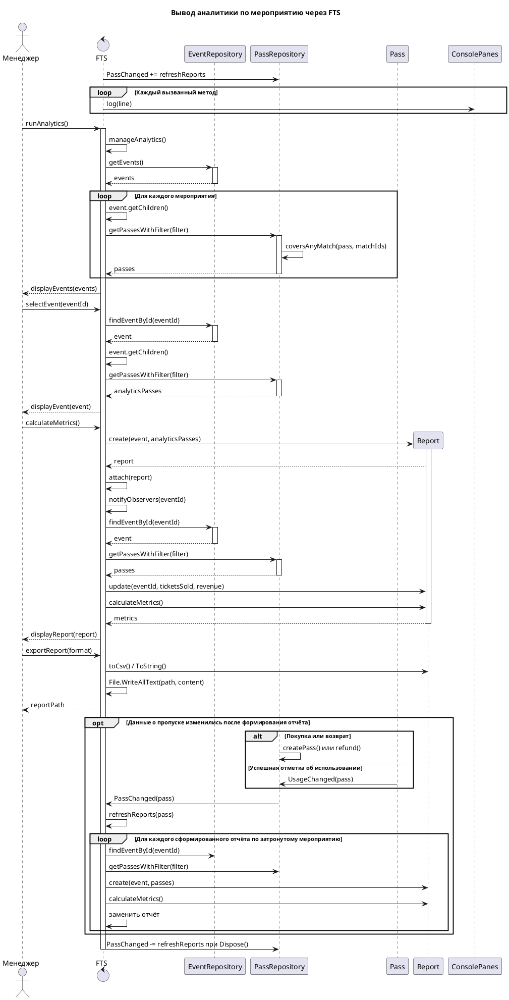

Диаграмма показывает текущую реализацию аналитики в FTS.

```plantuml
@startuml
title Вывод аналитики по мероприятию через FTS

actor "Менеджер" as Manager
control "FTS" as FTS
participant "EventRepository" as EventRepository
participant "PassRepository" as PassRepository
participant "Pass" as Pass
participant "Report" as Report
participant "ConsolePanes" as Panes

FTS -> PassRepository : PassChanged += refreshReports

loop Каждый вызванный метод
    FTS -> Panes : log(line)
end

Manager -> FTS : runAnalytics()
activate FTS

FTS -> FTS : manageAnalytics()
FTS -> EventRepository : getEvents()
activate EventRepository
EventRepository --> FTS : events
deactivate EventRepository

loop Для каждого мероприятия
    FTS -> FTS : event.getChildren()
    FTS -> PassRepository : getPassesWithFilter(filter)
    activate PassRepository
    PassRepository -> PassRepository : coversAnyMatch(pass, matchIds)
    PassRepository --> FTS : passes
    deactivate PassRepository
end

FTS --> Manager : displayEvents(events)

Manager -> FTS : selectEvent(eventId)
FTS -> EventRepository : findEventById(eventId)
activate EventRepository
EventRepository --> FTS : event
deactivate EventRepository

FTS -> FTS : event.getChildren()
FTS -> PassRepository : getPassesWithFilter(filter)
activate PassRepository
PassRepository --> FTS : analyticsPasses
deactivate PassRepository
FTS --> Manager : displayEvent(event)

Manager -> FTS : calculateMetrics()

create Report
FTS -> Report : create(event, analyticsPasses)
activate Report
Report --> FTS : report

FTS -> FTS : attach(report)
FTS -> FTS : notifyObservers(eventId)
FTS -> EventRepository : findEventById(eventId)
activate EventRepository
EventRepository --> FTS : event
deactivate EventRepository

FTS -> PassRepository : getPassesWithFilter(filter)
activate PassRepository
PassRepository --> FTS : passes
deactivate PassRepository

FTS -> Report : update(eventId, ticketsSold, revenue)
FTS -> Report : calculateMetrics()
Report --> FTS : metrics
deactivate Report
FTS --> Manager : displayReport(report)

Manager -> FTS : exportReport(format)
FTS -> Report : toCsv() / ToString()
FTS -> FTS : File.WriteAllText(path, content)
FTS --> Manager : reportPath

opt Данные о пропуске изменились после формирования отчёта
    alt Покупка или возврат
        PassRepository -> PassRepository : createPass() или refund()
    else Успешная отметка об использовании
        Pass -> PassRepository : UsageChanged(pass)
    end
    PassRepository -> FTS : PassChanged(pass)
    FTS -> FTS : refreshReports(pass)
    loop Для каждого сформированного отчёта по затронутому мероприятию
        FTS -> EventRepository : findEventById(eventId)
        FTS -> PassRepository : getPassesWithFilter(filter)
        FTS -> Report : create(event, passes)
        FTS -> Report : calculateMetrics()
        FTS -> FTS : заменить отчёт
    end
end

FTS -> PassRepository : PassChanged -= refreshReports при Dispose()

deactivate FTS
@enduml
```
