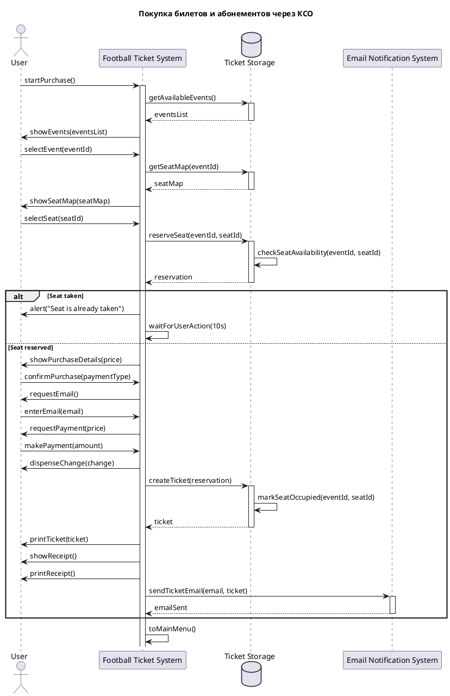

```plantuml
@startuml
title Покупка билетов и абонементов через КСО

actor "User" as User
participant "Football Ticket System" as FTS
database "Ticket Storage" as TicketStorage
participant "Email Notification System" as EmailSystem

User -> FTS : startPurchase()
activate FTS
FTS -> TicketStorage : getAvailableEvents()
activate TicketStorage
TicketStorage --> FTS : eventsList
deactivate TicketStorage
FTS -> User : showEvents(eventsList)

User -> FTS : selectEvent(eventId)
FTS -> TicketStorage : getSeatMap(eventId)
activate TicketStorage
TicketStorage --> FTS : seatMap
deactivate TicketStorage
FTS -> User : showSeatMap(seatMap)

User -> FTS : selectSeat(seatId)
FTS -> TicketStorage : reserveSeat(eventId, seatId)
activate TicketStorage
TicketStorage -> TicketStorage : checkSeatAvailability(eventId, seatId)
TicketStorage --> FTS : reservation
deactivate TicketStorage

alt Seat taken
    FTS -> User : alert("Seat is already taken")
    FTS -> FTS : waitForUserAction(10s)
else Seat reserved
    FTS -> User : showPurchaseDetails(price)
    User -> FTS : confirmPurchase(paymentType)
    FTS -> User : requestEmail()
    User -> FTS : enterEmail(email)
    FTS -> User : requestPayment(price)
    User -> FTS : makePayment(amount)
    FTS -> User : dispenseChange(change)

    FTS -> TicketStorage : createTicket(reservation)
    activate TicketStorage
    TicketStorage -> TicketStorage : markSeatOccupied(eventId, seatId)
    TicketStorage --> FTS : ticket
    deactivate TicketStorage

    FTS -> User : printTicket(ticket)
    FTS -> User : showReceipt()
    FTS -> User : printReceipt()

    FTS -> EmailSystem : sendTicketEmail(email, ticket)
    activate EmailSystem
    EmailSystem --> FTS : emailSent
    deactivate EmailSystem
end

FTS -> FTS : toMainMenu()

@enduml
```
