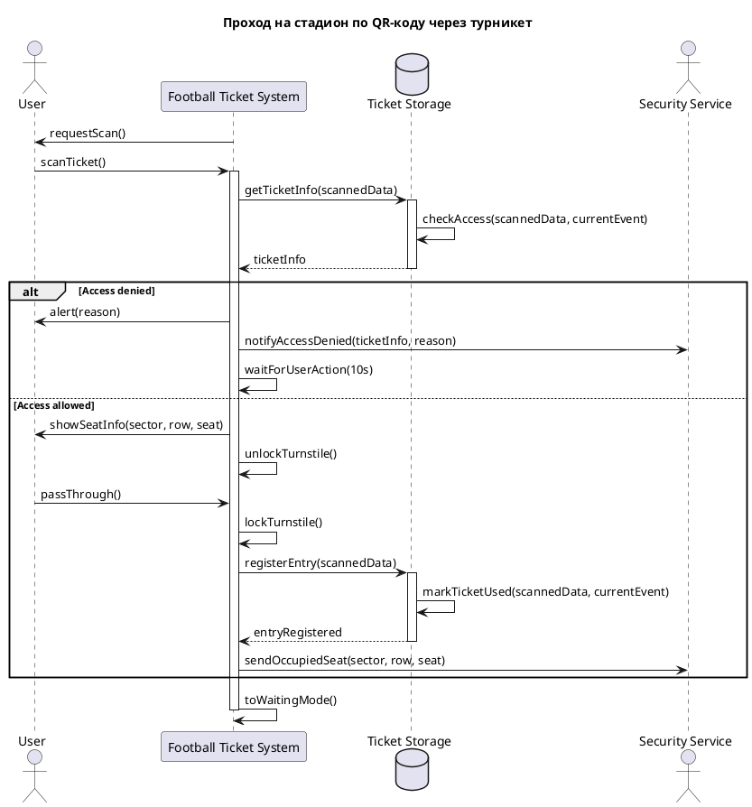

```plantuml
@startuml
title Проход на стадион по QR-коду через турникет

actor "User" as User
participant "Football Ticket System" as FTS
database "Ticket Storage" as TicketStorage
actor "Security Service" as Security

FTS -> User : requestScan()
User -> FTS : scanTicket()
activate FTS

FTS -> TicketStorage : getTicketInfo(scannedData)
activate TicketStorage
TicketStorage -> TicketStorage : checkAccess(scannedData, currentEvent)
TicketStorage --> FTS : ticketInfo
deactivate TicketStorage

alt Access denied
    FTS -> User : alert(reason)
    FTS -> Security : notifyAccessDenied(ticketInfo, reason)
    FTS -> FTS : waitForUserAction(10s)
else Access allowed
    FTS -> User : showSeatInfo(sector, row, seat)
    FTS -> FTS : unlockTurnstile()
    User -> FTS : passThrough()
    FTS -> FTS : lockTurnstile()

    FTS -> TicketStorage : registerEntry(scannedData)
    activate TicketStorage
    TicketStorage -> TicketStorage : markTicketUsed(scannedData, currentEvent)
    TicketStorage --> FTS : entryRegistered
    deactivate TicketStorage

    FTS -> Security : sendOccupiedSeat(sector, row, seat)
end

FTS -> FTS : toWaitingMode()
deactivate FTS

@enduml
```
