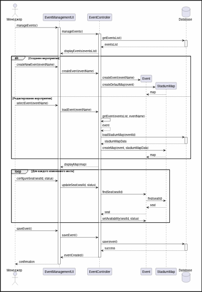

```plantuml

actor "Менеджер" as Manager

participant "EventManagementUI" as UI
participant "EventController" as Controller
participant "Event" as Event
participant "StadiumMap" as Map
database "Database" as DB

Manager -> UI : createEvent()
activate UI
UI -> Controller : createEvent()
activate Controller

create Event
Controller -> Event : create()
Controller -> DB : loadStadiumMap(stadiumId)
activate DB
DB --> Controller : stadiumMapData
deactivate DB

create Map
Controller -> Map : create(stadiumMapData)
Map --> Controller : map
Controller --> UI : displayMap(map)

loop Для каждого изменяемого места
    Manager -> UI : configureSeat(seatId, status)
    UI -> Controller : updateSeat(seatId, status)
    Controller -> Map : findSeat(seatId)
    activate Map
    Map --> Controller : seat
    Controller -> Map : setAvailability(seatId, status)
    deactivate Map
end

Manager -> UI : saveEvent()
UI -> Controller : saveEvent()
Controller -> DB : save(event, map)
activate DB
DB --> Controller : success
deactivate DB
Controller --> UI : eventCreated()
deactivate Controller
UI --> Manager : confirmation
deactivate UI

@enduml
```
