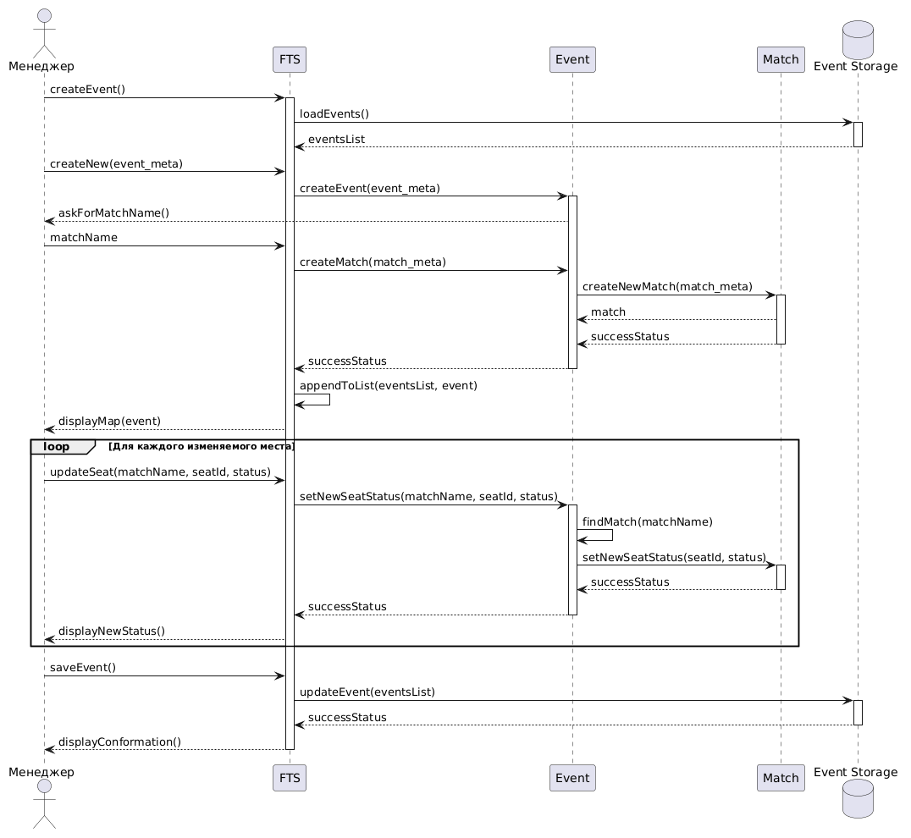
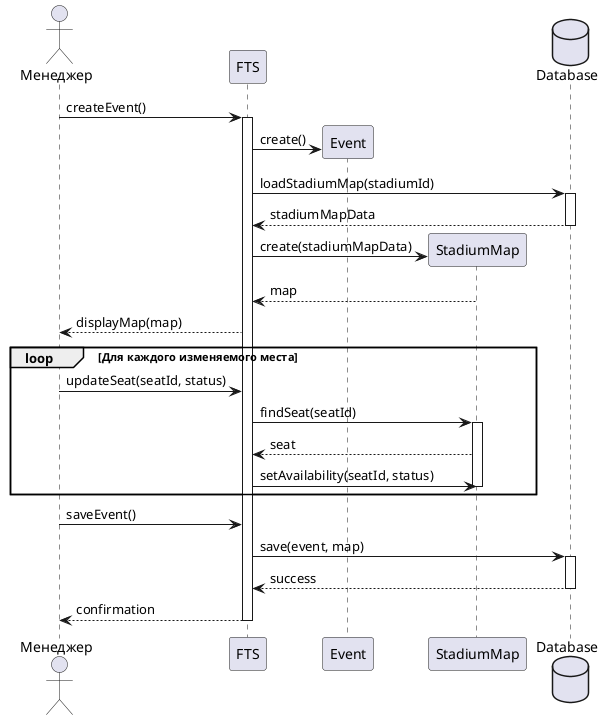

```plantuml
@startuml

actor "Менеджер" as Manager

participant "FTS" as Controller
participant "Event" as Event
participant "StadiumMap" as Map
database "Database" as DB

Manager -> Controller : createEvent()
activate Controller

create Event
Controller -> Event : create()
Controller -> DB : loadStadiumMap(stadiumId)
activate DB
DB --> Controller : stadiumMapData
deactivate DB

create Map
Controller -> Map : create(stadiumMapData)
Map --> Controller : map
Controller --> Manager : displayMap(map)

loop Для каждого изменяемого места
    Manager -> Controller : updateSeat(seatId, status)
    Controller -> Map : findSeat(seatId)
    activate Map
    Map --> Controller : seat
    Controller -> Map : setAvailability(seatId, status)
    deactivate Map
end

Manager -> Controller : saveEvent()
Controller -> DB : save(event, map)
activate DB
DB --> Controller : success
deactivate DB
Controller --> Manager : confirmation
deactivate Controller 

@enduml
```
