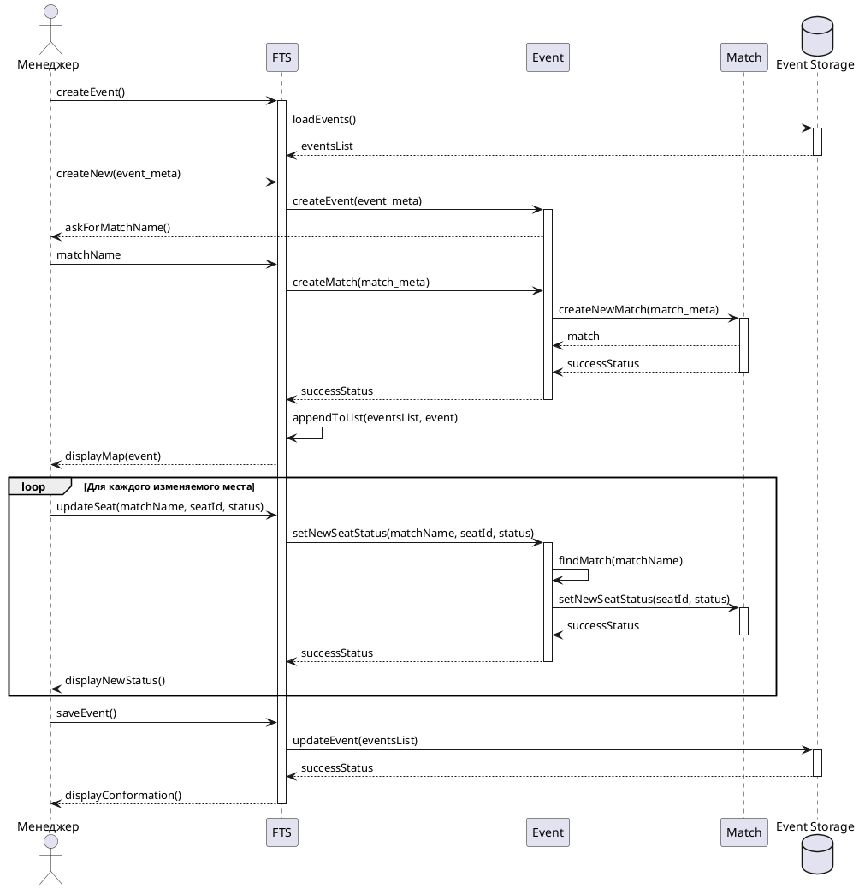

```plantuml
@startuml
actor "Менеджер" as Manager

participant "FTS" as Controller
participant "Event" as Event
participant "Match" as Match
database "Event Storage" as DB

Manager -> Controller : createEvent()
activate Controller
Controller -> DB : loadEvents()
activate DB
DB --> Controller : eventsList
deactivate DB
Manager -> Controller : createNew(event_meta)
Controller -> Event : createEvent(event_meta)
activate Event
Event --> Manager : askForMatchName()
Manager -> Controller : matchName
Controller -> Event : createMatch(match_meta)
Event -> Match : createNewMatch(match_meta)
activate Match
Match --> Event : match

Match --> Event : successStatus
deactivate Match
Event --> Controller : successStatus
deactivate Event
Controller -> Controller : appendToList(eventsList, event)
Controller --> Manager : displayMap(event)

loop Для каждого изменяемого места
    Manager -> Controller : updateSeat(matchName, seatId, status)
    Controller -> Event : setNewSeatStatus(matchName, seatId, status)
    activate Event
    Event -> Event : findMatch(matchName)
    Event -> Match : setNewSeatStatus(seatId, status)
    activate Match
    Match --> Event : successStatus
    deactivate Match
    Event --> Controller : successStatus
    deactivate Event
    Controller --> Manager : displayNewStatus()
end

Manager -> Controller : saveEvent()
Controller -> DB : updateEvent(eventsList)
activate DB
DB --> Controller : successStatus
deactivate DB
Controller --> Manager : displayConformation()
deactivate Controller
@enduml
```
