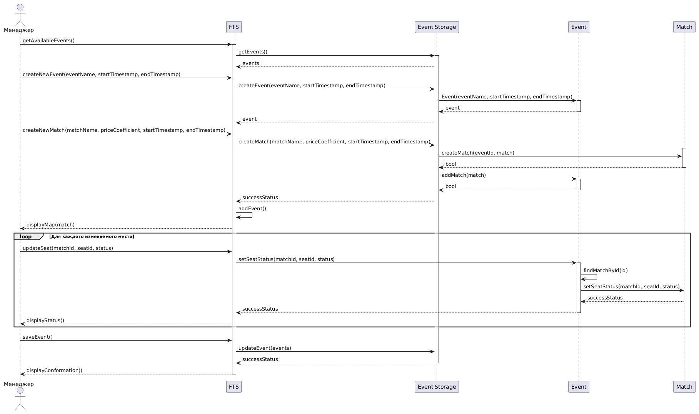
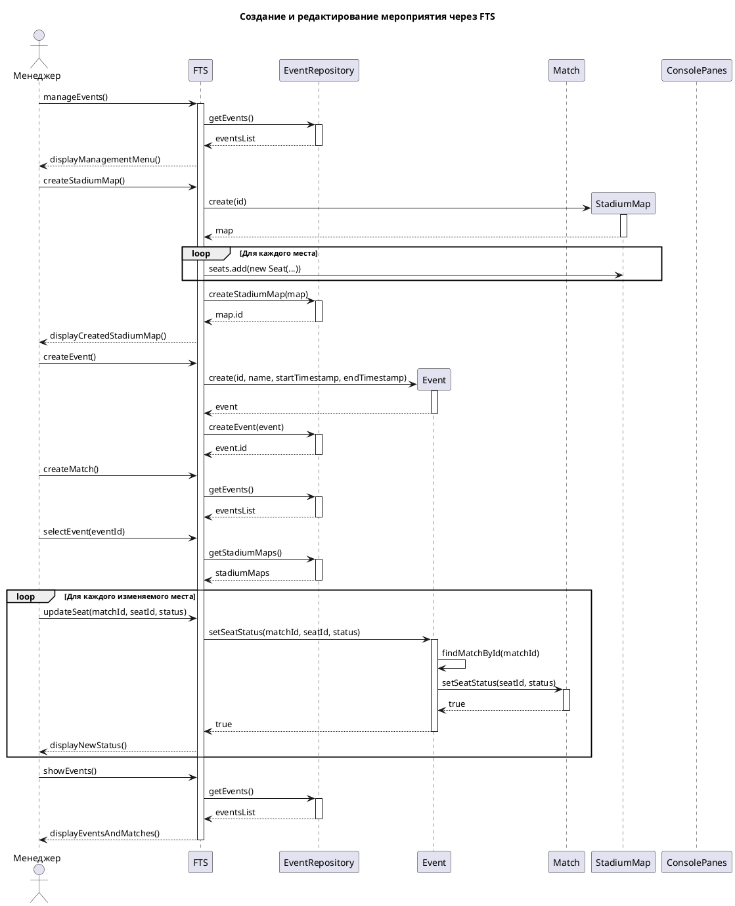

```plantuml
@startuml
title Создание и редактирование мероприятия через FTS

actor "Менеджер" as Manager

participant "FTS" as FTS
participant "EventRepository" as EventRepository
participant "Event" as Event
participant "Match" as Match
participant "StadiumMap" as StadiumMap
participant "ConsolePanes" as Panes

Manager -> FTS : manageEvents()
activate FTS

FTS -> EventRepository : getEvents()
activate EventRepository
EventRepository --> FTS : eventsList
deactivate EventRepository
FTS --> Manager : displayManagementMenu()

        Manager -> FTS : createStadiumMap()
        create StadiumMap
        FTS -> StadiumMap : create(id)
        activate StadiumMap
        StadiumMap --> FTS : map
        deactivate StadiumMap

        loop Для каждого места
            FTS -> StadiumMap : seats.add(new Seat(...))
        end

        FTS -> EventRepository : createStadiumMap(map)
        activate EventRepository
        EventRepository --> FTS : map.id
        deactivate EventRepository
        FTS --> Manager : displayCreatedStadiumMap()


    Manager -> FTS : createEvent()
    create Event
    FTS -> Event : create(id, name, startTimestamp, endTimestamp)
    activate Event
    Event --> FTS : event
    deactivate Event

    FTS -> EventRepository : createEvent(event)
    activate EventRepository
    EventRepository --> FTS : event.id
    deactivate EventRepository

    Manager -> FTS : createMatch()
    FTS -> EventRepository : getEvents()
    activate EventRepository
    EventRepository --> FTS : eventsList
    deactivate EventRepository
    Manager -> FTS : selectEvent(eventId)

    FTS -> EventRepository : getStadiumMaps()
    activate EventRepository
    EventRepository --> FTS : stadiumMaps
    deactivate EventRepository


loop Для каждого изменяемого места
    Manager -> FTS : updateSeat(matchId, seatId, status)
    FTS -> Event : setSeatStatus(matchId, seatId, status)
    activate Event
    Event -> Event : findMatchById(matchId)
    Event -> Match : setSeatStatus(seatId, status)
    activate Match
    Match --> Event : true
    deactivate Match
    Event --> FTS : true
    deactivate Event
    FTS --> Manager : displayNewStatus()
end

Manager -> FTS : showEvents()
FTS -> EventRepository : getEvents()
activate EventRepository
EventRepository --> FTS : eventsList
deactivate EventRepository
FTS --> Manager : displayEventsAndMatches()

deactivate FTS
@enduml
```
