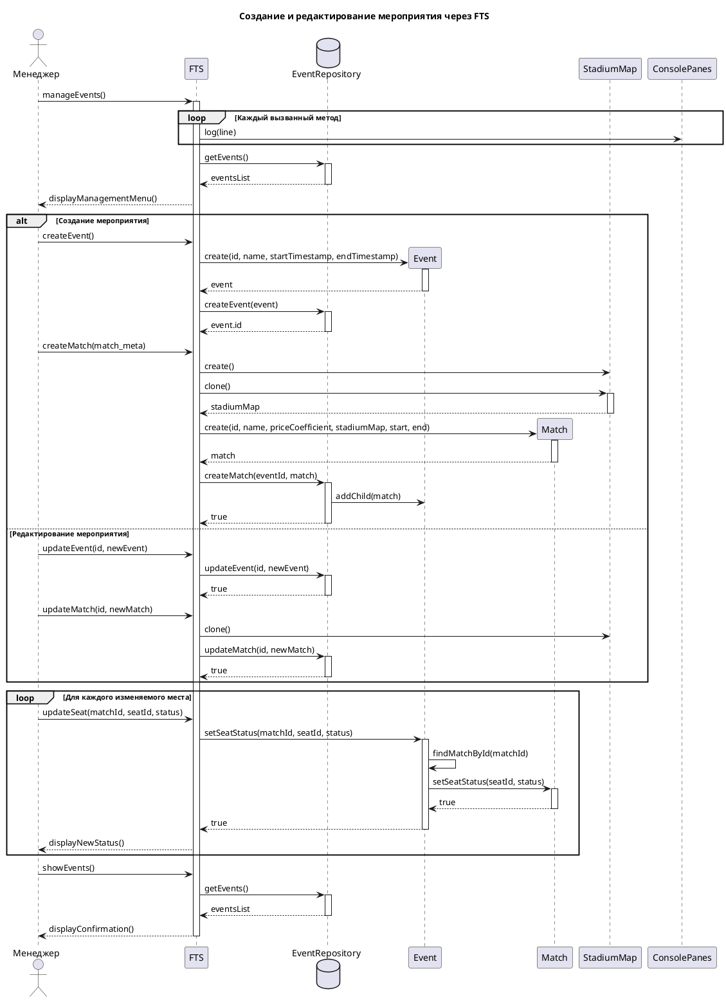

```plantuml
@startuml
title Создание и редактирование мероприятия через FTS

actor "Менеджер" as Manager

participant "FTS" as FTS
database "EventRepository" as EventRepository
participant "Event" as Event
participant "Match" as Match
participant "StadiumMap" as StadiumMap
participant "ConsolePanes" as Panes

Manager -> FTS : manageEvents()
activate FTS

loop Каждый вызванный метод
    FTS -> Panes : log(line)
end

FTS -> EventRepository : getEvents()
activate EventRepository
EventRepository --> FTS : eventsList
deactivate EventRepository
FTS --> Manager : displayManagementMenu()

alt Создание мероприятия
    Manager -> FTS : createEvent()
    create Event
    FTS -> Event : create(id, name, startTimestamp, endTimestamp)
    activate Event
    Event --> FTS : event
    deactivate Event

    FTS -> EventRepository : createEvent(event)
    activate EventRepository
    EventRepository --> FTS : event.id
    deactivate EventRepository

    Manager -> FTS : createMatch(match_meta)
    FTS -> StadiumMap : create()
    FTS -> StadiumMap : clone()
    activate StadiumMap
    StadiumMap --> FTS : stadiumMap
    deactivate StadiumMap

    create Match
    FTS -> Match : create(id, name, priceCoefficient, stadiumMap, start, end)
    activate Match
    Match --> FTS : match
    deactivate Match

    FTS -> EventRepository : createMatch(eventId, match)
    activate EventRepository
    EventRepository -> Event : addChild(match)
    EventRepository --> FTS : true
    deactivate EventRepository
else Редактирование мероприятия
    Manager -> FTS : updateEvent(id, newEvent)
    FTS -> EventRepository : updateEvent(id, newEvent)
    activate EventRepository
    EventRepository --> FTS : true
    deactivate EventRepository

    Manager -> FTS : updateMatch(id, newMatch)
    FTS -> StadiumMap : clone()
    FTS -> EventRepository : updateMatch(id, newMatch)
    activate EventRepository
    EventRepository --> FTS : true
    deactivate EventRepository
end

loop Для каждого изменяемого места
    Manager -> FTS : updateSeat(matchId, seatId, status)
    FTS -> Event : setSeatStatus(matchId, seatId, status)
    activate Event
    Event -> Event : findMatchById(matchId)
    Event -> Match : setSeatStatus(seatId, status)
    activate Match
    Match --> Event : true
    deactivate Match
    Event --> FTS : true
    deactivate Event
    FTS --> Manager : displayNewStatus()
end

Manager -> FTS : showEvents()
FTS -> EventRepository : getEvents()
activate EventRepository
EventRepository --> FTS : eventsList
deactivate EventRepository
FTS --> Manager : displayConfirmation()

deactivate FTS
@enduml
```
